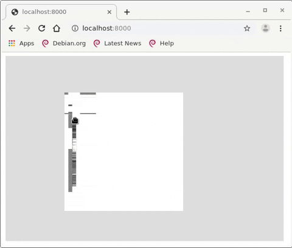

# YAND (Yet another NAND dumper)

**WARNING, WRITING HASN'T BEEN TESTED YET**

The script lets you read a whole NAND flash (user data & OOB) to a file, and restore a complete dump on a NAND Flash.

It uses ft2232H to connect to a TSOP48. For the pinout & connections, refer to [this diagram](https://github.com/ohjeongwook/DumpFlash/blob/master/schematics.png).

This was heavily inspired from [https://github.com/ohjeongwook/DumpFlash](https://github.com/ohjeongwook/DumpFlash).

YAND aims at making it easy to copy all data from a NAND flash into a file, or the other way around.

It is *NOT* going to do your homework trying to figure out NAND flash geometry. While it supports ONFI autodetection, if this isn't offered by your chip, you're on your own.

The Hardware used is the same as that project. More information regarding the Nand dumping process at:
[https://www.blackhat.com/docs/us-14/materials/us-14-Oh-Reverse-Engineering-Flash-Memory-For-Fun-And-Benefit-WP.pdf](https://www.blackhat.com/docs/us-14/materials/us-14-Oh-Reverse-Engineering-Flash-Memory-For-Fun-And-Benefit-WP.pdf)

## Installation

```
VENV="$(mktemp -d)"
virtualenv -p python3.7 "${VENV}"
source "${VENV}/bin/activate"

git clone https://github.com/conchyliculture/yand
cd yand
python setup.py install
```

## Usage

```
usage: yand_cli.py [-h] [-V] [-r] [-w] [-f FILE] [-P PAGE_SIZE]
                   [-B PAGES_PER_BLOCK] [-K NUMBER_OF_BLOCKS]

optional arguments:
  -h, --help            show this help message and exit
  -V, --version         Show version
  -r, --read            Read all NAND Flash
  -w, --write           Write NAND from a raw dump
  -f FILE, --file FILE  File to write to, or read from
  -P PAGE_SIZE, --page_size PAGE_SIZE
                        Specify page size & OOB size in bytes, ie: "2048,128"
  -B PAGES_PER_BLOCK, --pages_per_block PAGES_PER_BLOCK
                        Specify the number of pages per block
  -K NUMBER_OF_BLOCKS, --number_of_blocks NUMBER_OF_BLOCKS
                        Specify the number blocks
```

For a first detection of you NAND Flash, run the script with no option. This will attempt autodetection of the flash geometry with ONFI:
```
$ yand_cli.py
Chip model & Manufacturer: MT29F32G08CBACAWP (MICRON)
Page Size : 4320 (4096 + 224)
Blocks number : 4096
Device Size: 4GiB
```

then you can start dumping
```
$ yand_cli.py -r -f dump.bin
<wait>
```

If the flash doesn't support ONFI, you'll have to find the geometry yourself. Use the chip serial number as well as the ID returned but the chip:
```
yand.errors.YandException: Warning: Could not read ONFI info. Please provide geometry
Flash returned "98d384a5"
```

Refer to the device datasheet to do the proper calculations, then set the parameters:
```
yand_cli.py  -P 2048,64 -B 64 -K 65536
Chip model & Manufacturer: Unknown Model (Unknown Manufacturer)
Page Size : 2112 (2048 + 64)
Blocks number : 65536
Device Size: 8GiB
```

If this looks correct to you, start dumping:
```
yand_cli.py  -P 2048,64 -B 64 -K 65536 -r -f dump.bin
```

## Visualization

Go read the relevant [doc](TOOLS.md) to see your dump in a fancy JS zoom thing:


